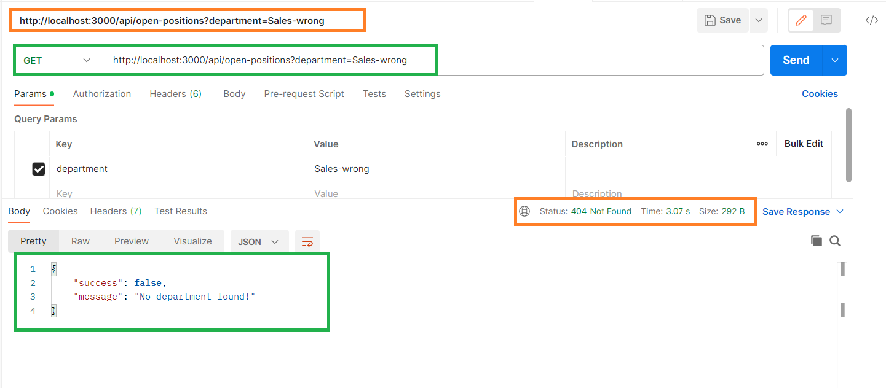

# Actian Careers - Your Take-Home API Project Challenge!
Your task is to create a simple Node.js RESTful application with only one endpoint that 
makes an API call to Actian Careers and request an HTML page, and parse through the HTML 
to retrieve list of titles of open positions for a department.
The application endpoint should work for every department section under Open Positions
from https://www.actian.com/company/careers link. 
The http response content must contain a list of titles of open positions for a department 
with appropriate http status code.

## Used technologies
- Node.js (v18.15.0)
- Express.js (v4.18.2)
- OpenAPI/Swagger

## Used PORT
Express Server running Port: ```3000```

## How to install dependencies in the express server?
`npm install`

## How to run the express server?
`npm start`


## Endpoint URL
`http://localhost:3000/api/open-positions?department=Engineering`


## Postman Endpoints

### Get the list of open positions for a depertment
```
Method: GET
Endpoint: /api/open-positions?department={department}
Host: http://localhost:3000
URL: http://localhost:3000/api/open-positions?department={department}
```

## Postman Success Request:


## Postman Failed Request:



## OpenAPI/Swagger URL
`http://localhost:3000/api-docs`


## Integration Tests
Within the `tests` directory, we wrote the test cases for this application. Below are the scenarios:

- Implemented one positive test case.
- Implemented three negative test cases.
### How to run the express server?
`npm run test`

